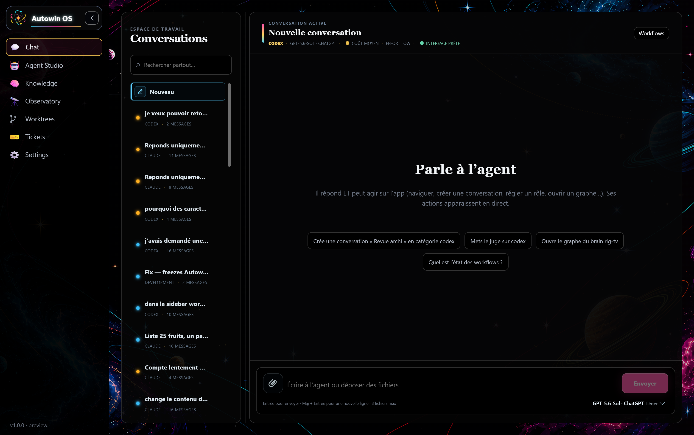
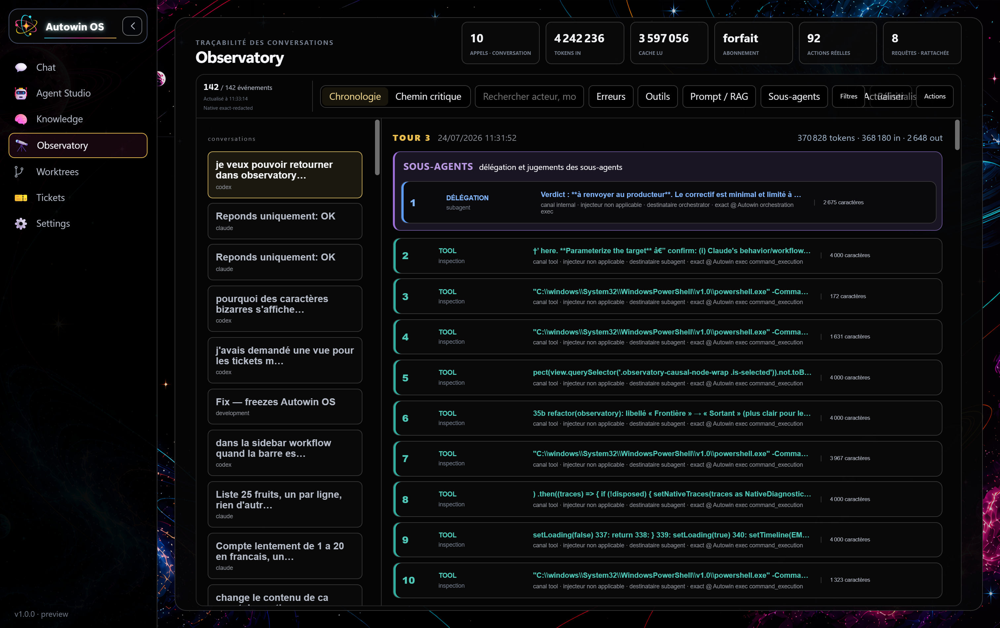
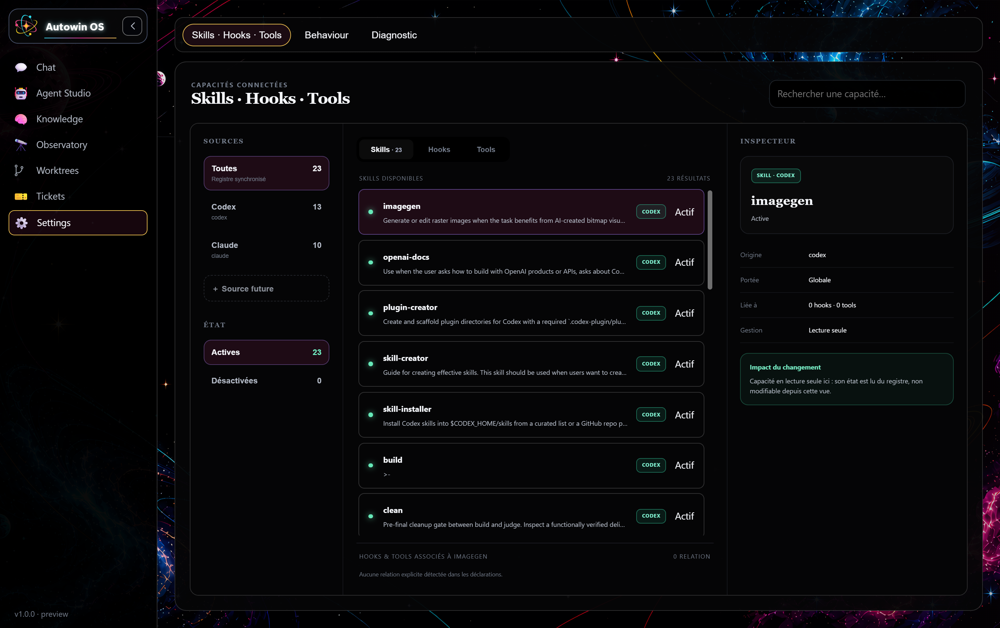

<div align="center">

# Autowin OS

**Cockpit d'orchestration d'agents — Electron · React · TypeScript**

Un poste de pilotage où l'on lance, observe et discipline des agents IA à travers plusieurs
fournisseurs (Claude, Codex/ChatGPT, Kimi…), avec un pipeline de travail et un enforcement
déterministe intégrés.

</div>

---

## Sommaire

- [C'est quoi](#cest-quoi)
- [Workflow « Chantier Autowin »](#workflow--chantier-autowin-)
- [Fonctionnalités clés](#fonctionnalités-clés)
- [Architecture](#architecture)
- [Démarrage rapide](#démarrage-rapide)
- [Structure du dépôt](#structure-du-dépôt)
- [Scripts npm](#scripts-npm)
- [Qualité & tests](#qualité--tests)
- [Contribuer](#contribuer)

---

## C'est quoi

Autowin OS est un **cockpit Electron** qui orchestre des agents IA. On y décrit une tâche ;
l'orchestrateur la **décompose**, la joue à travers un **pipeline** discipliné, la fait **juger**
par un rôle distinct, et n'autorise la clôture « verte » qu'avec une **preuve d'exécution vérifiée** —
le tout observable en direct.

Trois idées directrices :

1. **Multi-fournisseurs, un seul plan de contrôle.** Claude (CLI), Codex/ChatGPT (Responses API),
   Kimi… sont interchangeables derrière une interface commune. Le renderer envoie des *intentions* ;
   le process `main` détient les accès et exécute.
2. **Un pipeline, pas un prompt géant.** `scout → frame → terrain → build → clean → judge`, avec un
   juge **séparé** du producteur.
3. **L'enforcement vit dans le code, pas dans le prompt.** Un `HookBus` interne applique des
   garde-fous déterministes (dont un *verify-replay* qui **rejoue** réellement la vérification au lieu
   de croire l'agent sur parole) — uniforme quel que soit le fournisseur.

## Workflow « Chantier Autowin »

Profil livré d'origine (`chantier-autowin`, dans `src/main/workflow-defaults.ts`), le plus complet des
workflows par défaut.

**Quand l'utiliser** — une mission menée de bout en bout, quand la tâche n'est pas encore choisie ou
pas cadrée, et qu'elle demande de préparer le terrain avant d'écrire. Pour un simple défaut, préférer
*Correctif* ; pour un besoin déjà identifié, *Feature* ; pour une question, *Éclair*.

**Chemin** — `scout → frame → terrain → build → clean → judge`, chaque transition inconditionnelle.

**Retour** — un `judge` **rouge** renvoie au `build`, **2 reprises au maximum** ; la reprise repasse
ensuite par `clean` avant d'être rejugée. Aucun autre retour arrière n'existe dans ce profil.

**Agents** — aucun agent ni persona imposé : chaque phase reprend le fournisseur, le modèle et le
fan-out réglés dans Agent Studio au moment du run. Le profil est dupliquable, modifiable et
supprimable ; il n'est posé qu'une fois, à la création du fichier de profils.

## Aperçu

### Chat — parler à l'agent (qui répond ET agit sur l'app)


### Observatory — traçabilité des conversations (sortant / réponse / thinking / échecs, coût par modèle)


### Settings — capacités connectées (Skills · Hooks · Tools)


## Fonctionnalités clés

- **Orchestration multi-agents** — décomposition, fan-out multi-modèles, dispatch greedy, réparation
  bornée avant escalade humaine.
- **Pipeline discipliné + juge adversarial** — le juge audite, ne répare jamais ce qu'il audite.
- **HookBus interne (cycle de vie)** — events `pre-exec / post-exec / pre-green / run-stop` ; hooks TS
  in-repo (anti-flaky, fix-gate, done-without-proof) + **verify-replay** (re-jeu réel de la commande de
  vérif, opt-in via `AUTOWIN_VERIFY_REPLAY`).
- **Source control agentique** — surface git en lecture seule (branche, changements, diff visuel,
  historique) où chaque action **pré-remplit un prompt** envoyé à l'agent plutôt que d'exécuter du git
  en dur ; dépôt configurable (multi-repo).
- **Worktrees isolés** — chaque agent peut travailler dans une copie git isolée, fusionnée en fin de run.
- **Observabilité** — trace des sous-agents (sortant / réponse / thinking / échecs), coût par modèle,
  couleurs par type d'action.
- **Brain / RAG** — interrogation d'un service Python (`brain_server`) lancé en process **détaché**
  (survit à l'app).
- **Robustesse** — fermer la fenêtre ne tue plus l'app ni les runs (tray + `window-all-closed`).

## Architecture

Frontière de processus stricte (sécurité + testabilité) :

| Couche | Rôle |
|--------|------|
| **`main`** | Accès système, stores, adaptateurs fournisseurs, noyau `AutowinOS`, orchestrateur, gates/hooks. Détient tout ce qui touche disque/réseau. |
| **`preload`** | API IPC **bornée** exposée au renderer (aucun accès disque/fournisseur direct côté UI). |
| **`renderer`** | React/TS. Affiche l'état, envoie des *intentions* via IPC ; ne contacte jamais un fournisseur directement. |

Les consignes et l'enforcement sont **injectés par Autowin** ; quand l'exécuteur est le CLI `claude`,
il est lancé « nu » (`--setting-sources ""`) pour qu'Autowin reste la **source unique** (zéro doublon
avec un `CLAUDE.md` externe).

## Démarrage rapide

> Setup développeur complet (prérequis, CLI providers, brain_server, login) : **[ONBOARDING.md](ONBOARDING.md)**.

```bash
git clone https://dev.azure.com/AmitelGTC/AutoWinOS/_git/AutoWinOS
cd "AutoWinOS"
npm install
npm run bootstrap:deps   # installe les CLI providers + le venv brain_server (idempotent)
```

**Développement** (hot-reload) :

```bash
npm run dev
```

**Build local pour l'icône du Bureau** — commande canonique (reconstruit `dist\win-unpacked\autowin-os.exe`
puis met à jour le raccourci `Autowin OS.lnk`) :

```bash
npm run build:desktop
```

> ⚠️ Toujours passer par `build:desktop` pour la version Bureau : ne pas pointer le raccourci vers un
> ancien sous-dossier de validation.

## Structure du dépôt

```
src/
├─ main/            # process principal (accès système + logique)
│  ├─ providers/    # adaptateurs Claude (CLI), Codex/ChatGPT (API), Kimi…
│  ├─ hooks/        # HookBus + verify-replay (enforcement déterministe)
│  ├─ gates/        # stopgate + hooks synchrones (anti-flaky, fix-gate…)
│  ├─ runs/         # persistance de la trace des runs
│  ├─ store/        # conversations, worktrees (worktree-manager)
│  ├─ authority/ trust/ dashboards/ activity/ viz/ compute-fabric/
│  ├─ orchestrator.ts   # décomposition, pipeline, gate, juge
│  ├─ os.ts             # noyau AutowinOS
│  └─ models.ts         # catalogue de modèles + efforts par fournisseur
├─ preload/         # pont IPC borné
└─ renderer/        # UI React/TS (chat, observatoire, source control, worktrees)
```

## Scripts npm

| Script | Effet |
|--------|-------|
| `npm run dev` | Lancement développement (hot-reload) |
| `npm test` | Suite de tests (Vitest) |
| `npm run typecheck` | Typecheck `node` + `web` |
| `npm run lint` | ESLint |
| `npm run build:desktop` | Build + package local + rafraîchit l'icône Bureau |
| `npm run build:win` / `:mac` / `:linux` | Build distribuable par OS |
| `npm run bootstrap:deps` | Installe CLI providers + venv brain_server (idempotent) |
| `npm run codex:login` | Authentifie le compte Codex/ChatGPT (OAuth) |

## Qualité & tests

- **Tests** : Vitest — logique pure (`main`/`shared`) + rendu (`renderer`, environnement `happy-dom`).
- **Typecheck** : deux projets TS séparés (`node` et `web`).
- Avant un build Bureau, `build:desktop` **passe le typecheck** puis package.
- Le pipeline ne déclare « vert » qu'avec une **preuve hors-modèle vérifiée** (test/exit-code) — pas une
  auto-déclaration du modèle.

## Contribuer

1. Lire **[ONBOARDING.md](ONBOARDING.md)** (setup complet + conventions).
2. Brancher : `feat/…`, `fix/…`.
3. `npm run typecheck && npm test` doivent être verts.
4. Ouvrir une PR vers `main`.

---

<div align="center">
<sub>Autowin OS — cockpit d'orchestration d'agents · Electron + React + TypeScript</sub>
</div>
<!-- preuve attente integration 2 -->
